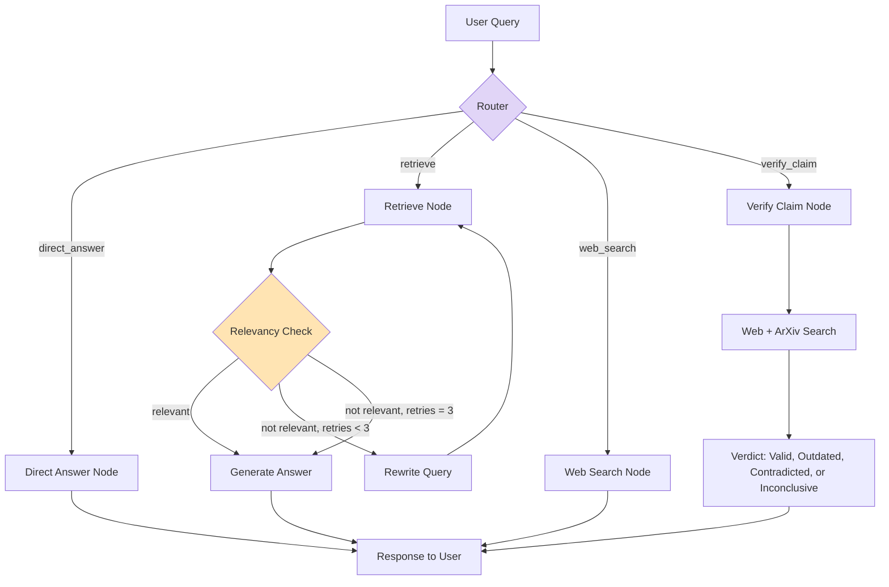

# 📄 Agentic RAG Chatbot

An agentic Retrieval-Augmented Generation (RAG) chatbot for research papers — built from scratch, inspired by [rag-papeer-project](https://github.com/Himanshu-1703/rag-papeer-project). Rather than a simple retrieve-then-generate pipeline, this system reasons about each query, self-corrects failed retrievals, verifies claims against live sources, and is backed by an automated, metric-driven evaluation pipeline.

## What it does

Upload a research paper (PDF, plain text/Markdown, a web URL, or search ArXiv), then ask questions about it in natural language. The system:

- **Classifies each query's intent** before answering — general knowledge, document-specific, live web search, or claim verification — and routes it accordingly
- **Self-corrects weak retrieval** — if the retrieved context doesn't sufficiently answer the question, it rewrites the query and retries (up to 3 attempts) before falling back
- **Verifies claims against current research** — checks whether a paper's stated finding still holds up, using live web and arXiv search, returning a graded verdict (still valid / outdated / contradicted / inconclusive)
- **Never fabricates answers** — if the loaded document doesn't contain the answer, it says so honestly
- **Supports multiple documents per session** for cross-document questions, with full session isolation between separate conversations
- **Has a side-channel for off-topic questions** (`/btw <question>`) that doesn't pollute the main conversation's context
- **Persists across restarts** — sessions, loaded papers, and conversation state survive an app restart
- **Is measured, not just demoed** — a DeepEval-based evaluation pipeline scores faithfulness, answer relevancy, and retrieval quality against a hand-written golden dataset

## Architecture


       

Built with **LangGraph** as a stateful graph (not a linear chain), so the self-correction loop and conditional routing are first-class parts of the architecture, not bolted-on logic.

## Tech stack

| Layer | Technology |
|---|---|
| Orchestration | LangGraph, LangChain |
| LLM | OpenAI (`gpt-5-mini`) |
| Embeddings | OpenAI `text-embedding-3-small`, disk-cached |
| Vector store | Qdrant Cloud, session-scoped collections |
| Web search | Tavily |
| UI | Streamlit |
| Persistence | SQLite (LangGraph checkpointer) + `sessions.json` |
| Evaluation | DeepEval (Contextual Precision/Recall/Relevancy, Answer Relevancy, Faithfulness) |
| Dependency management | uv |
| CI | GitHub Actions (Docker build verification) |

## Getting started

### Prerequisites
- Python 3.12+
- [uv](https://docs.astral.sh/uv/)
- API keys: OpenAI, Tavily, Qdrant Cloud

### Setup

```bash
git clone https://github.com/bhakti259/agentic-rag-chatbot.git
cd agentic-rag-chatbot
uv sync
cp .env.example .env   # then fill in your API keys
```

### Run

```bash
uv run streamlit run app.py
```

### Run with Docker

```bash
docker build -t agentic-rag-chatbot .
docker run -p 8501:8501 --env-file .env agentic-rag-chatbot
```
See [DOCKER_GUIDE.md](DOCKER_GUIDE.md) for details.

### Run the evaluation suite

```bash
uv run python evaluate.py
```

## Evaluation results

Measured against a 6-question hand-written golden dataset based on the GPT-4 System Card:

| Metric | Score |
|---|---|
| Answer Relevancy | 1.00 |
| Faithfulness | 1.00 |
| Contextual Recall | 1.00 |
| Contextual Precision | 0.72 |
| Contextual Relevancy | 0.56 |

The system never hallucinates and always addresses the question asked (perfect Faithfulness and Answer Relevancy). Contextual Relevancy is the honest, ongoing weak point — retrieval sometimes surfaces citation/reference noise alongside genuinely relevant content, particularly for source documents with large bibliography sections. A regex-based filtering heuristic (`is_citation_heavy`) roughly doubled this metric (0.28 → 0.56); a documented, partially-solved limitation, not swept under the rug.

## Known limitations (by design, not oversight)

- **Naive chunking has no structural awareness.** It can't distinguish a document's own primary content from examples, citations, or acknowledgments embedded within it — occasionally causing retrieval to surface tangential content that happens to sit close in embedding space.
- **The router works on query text alone**, with no session/document context — a claim-verification question without an explicit "in this paper" anchor may route to a general web search instead.
- **Session-level document accumulation is intentional**, not a bug — multiple papers loaded into one session are searchable together, supporting cross-document questions. Use "New Chat" to start with a clean slate.

## Project status

Core agentic pipeline, evaluation, multi-session support, and persistence are complete and tested. In progress: async/throttled evaluation concurrency, a graph-state inspector for debugging visibility, and streaming responses.

## License

MIT (or your preferred license)
